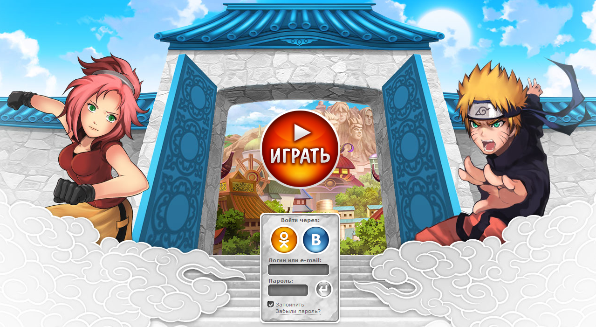

# Auto Pockie Ninja

[English](#english-section) | [Português](#portugues-section)

<div id="portuguese-content">

<h2 id="portugues-section">AutoBot para Pockie Ninja</h2>



### Descrição
AutoBot é uma ferramenta automatizada para realizar ações no jogo Pockie Ninja usando o navegador Coowon e Selenium.

# Requisitos
- Python 3.x
- Selenium
- Coowon Browser
- ChromeDriver 2.9

### Instalação
1. **Clone o Repositório**:
    ```bash
    Copiar código
    git clone <url_do_repositorio>
    cd <diretorio_do_repositorio>
    ```

2. **Instale as Dependências**:
    ```bash
    Copiar código
    pip install -r requirements.txt
    ```

3. **Configure os Caminhos**:
Atualize os caminhos para `webdriver` e `coowon_path` na classe `Utils` em `base/definitions.py`.

### Uso
1. **Criação de Conta e Personagem***:
    - Antes de usar o bot, crie uma conta no jogo e crie o personagem inicial.
   - O bot sempre usará o primeiro personagem da lista.

1. **Execute o AutoBot**:
    ```bash
    Copiar código
    python main.py
    ```

### Estrutura do Projeto
- `auto/auto_bot`.py: Contém a classe principal AutoBot para automação do navegador.
- `base/definitions`.py: Contém funções e configurações utilitárias.
- `main.py`: Inicializa e executa o AutoBot.

### Exemplo

```python
from auto.auto_bot import AutoBot

if __name__ == '__main__':
    auto = AutoBot()
    driver = auto.open_browser()
    driver = auto.open_page(driver)
    auto.type_credentials(driver, "seu_usuario", "sua_senha")
    auto.end(driver)
```

### Resolução de Problemas
- Certifique-se de que a versão do ChromeDriver corresponda à versão do Coowon Browser.
- Verifique se os caminhos estão configurados corretamente na classe Utils.

### Contribuindo
Contribuições são bem-vindas. Para grandes mudanças, abra uma issue primeiro para discutir o que você gostaria de mudar.

### Licença
[MIT](https://opensource.org/license/mit)

</div>

<div id="english-content" style="display:none;">
<h2 id="english-section">AutoBot for Pockie Ninja</h2>


### Description
AutoBot is an automated tool to perform actions in the game Pockie Ninja using the Coowon browser and Selenium.

### Requirements
- Python 3.x
- Selenium
- Coowon Browser
- ChromeDriver 2.9

### Installation
1. **Clone the Repository**:
    ```bash
    git clone <repository_url>
    cd <repository_directory>
    ```

2. **Install Dependencies**:
    ```bash
    pip install -r requirements.txt
    ```

3. **Configure Paths**:
    Update the paths for `webdriver` and `coowon_path` in the `Utils` class in `base/definitions.py`.

### Usage
1. **Create Account and Character**:
    - Before using the bot, create an account in the game and create the initial character.
    - The bot will always use the first character in the list.

1. **Run AutoBot**:
    ```bash
    python main.py
    ```

### Project Structure
- `auto/auto_bot.py`: Contains the main AutoBot class for browser automation.
- `base/definitions.py`: Contains utility functions and configurations.
- `main.py`: Initializes and runs the AutoBot.

### Example
```python
from auto.auto_bot import AutoBot

if __name__ == '__main__':
    auto = AutoBot()
    driver = auto.open_browser()
    driver = auto.open_page(driver)
    auto.type_credentials(driver, "your_username", "your_password")
    auto.end(driver)
```
### Troubleshooting
- Ensure the ChromeDriver version matches the Coowon Browser version.
- Check if paths are correctly set in the Utils class.
### Contributing
Pull requests are welcome. For major changes, please open an issue first to discuss what you would like to change.

### License
[MIT](https://opensource.org/license/mit)

</div>

<script>
  document.querySelectorAll('[href="#english-section"]').forEach(link => {
    link.addEventListener('click', () => {
      document.getElementById('portuguese-content').style.display = 'none';
      document.getElementById('english-content').style.display = 'block';
    });
  });

  document.querySelectorAll('[href="#português-section"]').forEach(link => {
    link.addEventListener('click', () => {
      document.getElementById('english-content').style.display = 'none';
      document.getElementById('portuguese-content').style.display = 'block';
    });
  });
</script>
